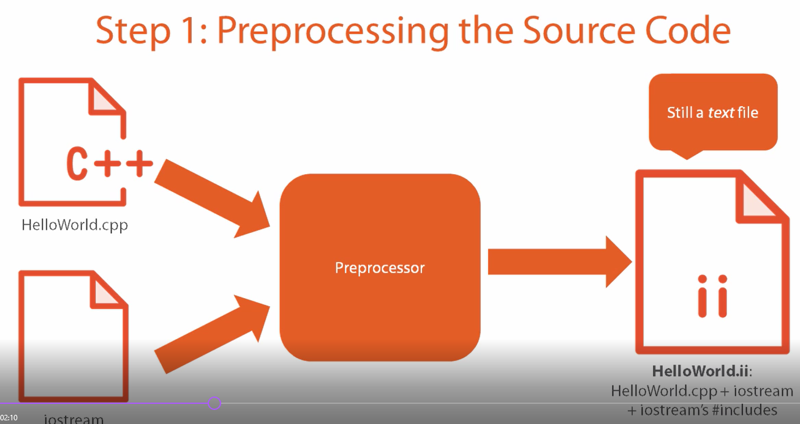
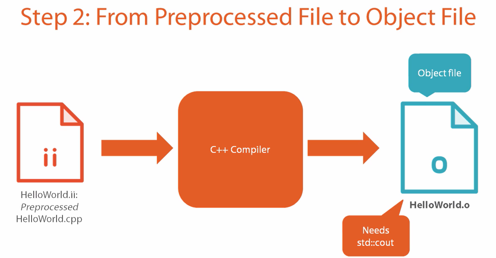
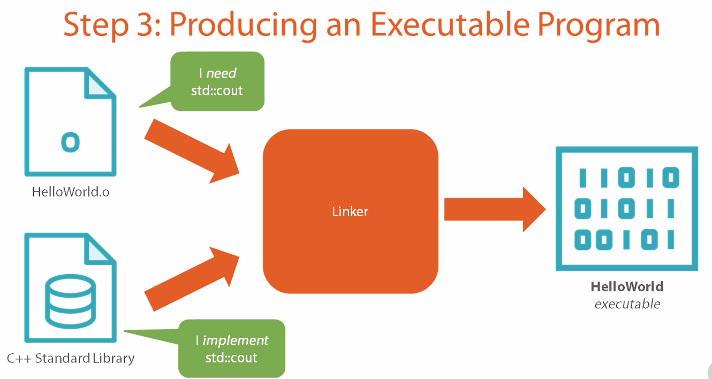
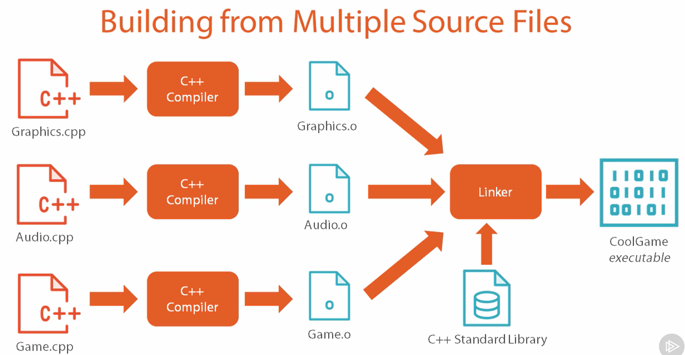
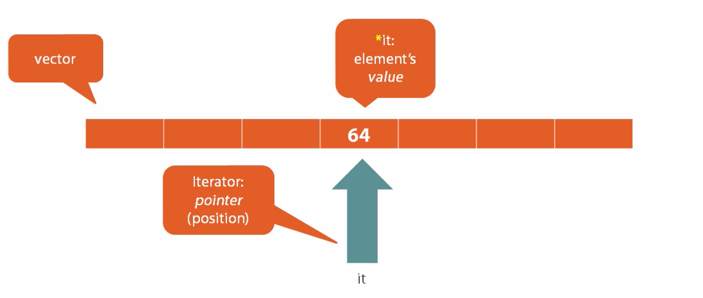
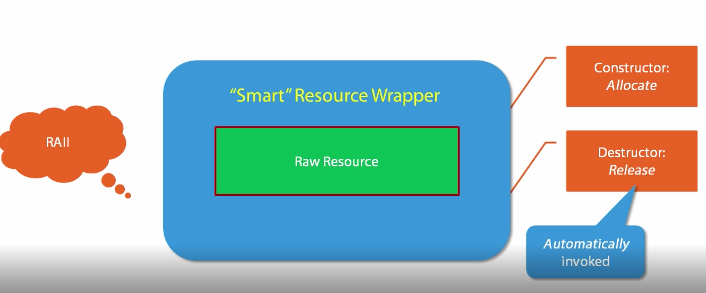

@(C)

# C++ 笔记
刘理想 2017-5-10 

[TOC]

## 编译

gcc编译：

```
gcc -o hello helloworld.cpp
```

使用clang: 
```
apt install install clang
```

clang编译：
```
clang++ helloworld.cpp
```

开启c++ 11:
```
clang++ -std=c++11 helloworld.cpp
```

显示所有警告： -Wall
```
clang++ -std=c++11 -Wall helloworld.cpp
```

显示部分警告：-Wextra

```
clang++ -std=c++11 -Wall -Wextra -o <output> <source>
```

```cpp
#include <iostream>

using namespace std;
int main(){
    count<<"Hello, world!"<<endl; //endl相当于\n+flush
    return 0;
}
```

`#include`是预处理指令









## 数据类型

### 整型

```cpp
#include <iostream> //For std::cout
#include <limits> //For std::numeric_limits

using namespace std;

int main(int argc, char const *argv[])
{
	cout << " int type\n";
	cout << "----------\n";
	cout << " Size: " << sizeof(int) << "bytes\n";
	cout << " Max: " << numeric_limits<int>::max() << "\n";
	cout << " Min: " << numeric_limits<int>::min() << "\n";
	return 0;
}
```

输出如下：
```
 int type
----------
 Size: 4bytes
 Max: 2147483647
 Min: -2147483648
```

### 声明和初始化

c++ 11 中 的变量声明与默认初始化：

```cpp
int n{}; //{} 默认初始化为 0
int m{64};
double n1{3.14};
bool b{true};
auto q{64}; //编译器推断类型
auto q1{6.4};
```

其它方式的初始化
```cpp
int n; //n包含的是内存垃圾，没有进行初始化，不要这样用。
```

double类型不要用`==`进行比较，在编译时可以检查出来是否包含这种比较：
```
clang++ -std=c++11 -Wall -Wextra -Wfloat-equal xx.cpp
```

### string类

```cpp
char letter{'c'};
char newLine{'\n'};
```

```
#include <string> //std::string
string s{}; //空字符串
string s; //空字符串
string userName{"Liu Lixiang"};

//字符串连接
m = strA + StringB

//字符串长度
name.length();


```
`std::string`是个类。

```cpp
#include <iostream> //std::cin, std::cout
#include <string> //std::string, std::getline

using namespace std;

int main(int argc, char const *argv[])
{
	cout << "Message? ";
	string message{};
	//读取字符串，不用cin是因为cin遇到第一个空格就算结束
	getline(cin, message);

	//使用同一个字符和长度进行初始化，注意这里的初始化方法
	string flowLine(message.length() + 4, '*');

	cout << '\n';
	cout << flowLine << '\n';
	cout << "* " << message << " *\n";
	cout << flowLine << '\n';
	return 0;
}
```

### 常量

`const`

```cpp
const int lineCOunt = ...; 
int const lineCount = ...; //跟上面的等价
```
对const变量的修改会在编译期报错.
c++11提供了`constexpr`来定义真正的常量：
```
constexpr double pi = 3.14159265;
```

## 控制

产生随机数，需要三个要素

- Engine: Mersenne Twister `std::mt19937`, generate high-quality random bits. PRNG
- Distribution: Uniform ditribution均匀分布 `uniform_int_distribution`
- Random seed:  使用`random_device`来初始化引擎。

```cpp
#include <iostream>
#include <random>

using namespace std;

int main(int argc, char const *argv[])
{
	//1.种子
	random_device seed{};

	//2.随机数发生器 random number generator
	mt19937 engine{seed()};

	//3. 均匀分布 uniformly ditribute 从[1..10]
	uniform_int_distribution<> dis{1, 10};

	//4. 产生随机正数
	int x{ dis(engine)};

	cout << x << "\n";
	return 0;
}
```

### range

字符转换

```cpp
#include <cctype>
char u = std::toupper(c);
```

for each循环
```cpp
for (char c: s) {
}

for(auto c: s) {
}
```

## 函数

### 参数引用

参数默认是按值传递，我们可以声明为按照引用传递。

```cpp
//注意，在函数声明中，这个是引用
void swap(int & a, int & b) {
	int temp{a};
	a = b;
	b = temp;
}

int main() {
	int x{2};
	int y{8};
	count << "x:" << x << " y:" << y << endl;
	swap(a, b); //注意这里
	count << "x:" << x << " y:" << y << endl;
}
```

当然在`#include <utility>`中已经有`std::swap()`这个函数。

### 传递const 引用
有时候对象比较大的情况下，传递引用可以降低开销。但是我们又不想函数修改我们的值，这个时候我们使用const 引用：

```cpp
... Func(Image const& img); //注意const&
//也可以这样
... Func(const Image& img);
```

例子：

```cpp
#include <iostream>
#include <string>

using namespace std;

void underline(string const& s) {
	//创建一个=组成的相同长度的字符串
	string line(s.length(), '=');

	count<<s<<endl;
	count<<line<<endl; 
}

int main() {
	cout<<"Please enter a string";
	String str{};
	cin >> str;
	cout << endl;
	underline(str);
}
```

### 函数重载 Function Overloading

函数重载主要是参数类型或参数个数不一样，与返回值无关
```cpp
void swap(int &, int &)
void swap(double &, double &)
```

### C++11返回的新写法Trailing return types

```cpp
//经典语法
int round(double x)

//新写法
auto round(double x) -> int
```

## 容器Vector

### std::vector

STL: C++ Standard (Template) Library

```cpp
std::vector<float> data{};
```

vector能够动态增长，在内存中是连续的，对缓存很友好。

使用索引来访问元素：`v[index]`。 算法复杂度是o(1)

### vector基本操作

引入vector

```cpp
#include <vector> //使用std::vector
```

声明vector
```cpp
vector<int> numbers{};
vector<string> names{};

vector<int> numbers{11, 22, 33};
vector<string> names{"a", "b"};
```

注意：

```cpp
vector<int> v{10}; //注意只有一个元素10
vector<int> w(10); //创造10个值为0的vector
```

一些方法：

- `push_back` 追加元素
- `size` 元素个数
- `empty`是否为空
- `resize` 调整vector大小
- `clear` 清空元素

### 遍历vector元素

```cpp
for (auto e: v) {
	//处理元素e
}
```

注意，这里是元素拷贝。会有性能代价。

下面的引用方法可以避免拷贝，如果想要修改元素，就要这么做
```cpp
for (auto & e: v) {
	//
}
```

我们还可以用只读形式：

```cpp
for (auto const& e: v) {
	//...
}

for (const auto& e: v) {
	//...
}
```

上面的这个遍历方法不仅使用于vector，还是用于其它集合。

### vector demo

```cpp
#include <iostream>
#include <vector>

using std::cout;
using std::vector;

int main() {
	vector<int> v{1, 2, 3, 4};
	
	v.push_back(5);
	v.push_back(6);

	cout << "Size:" << v.size() << "\n";

	cout << "vector's elements:";
	for (int n: v) {
		cout << n << ' ';
	}
	cout << '\n';
}
```

### 迭代器与排序 iterator & sorting

```cpp
#include <algorithm>

//快排
std::sort(...sth...)

sort(first, last); //begin(v) v的开始, end(v) v的结尾
```


迭代器是什么类型：

```cpp
vector<int>::iterator
```
当然在c++11中，我们只需要`auto`就可以了。

容器内部使用的就是迭代器。使用iterator可以解耦。

下面的例子是从文件中读文件并且输出排序后行
```cpp
#include <algorithm>
#include <fstream> //std::ifstream
#include <iostream>
#include <string> //std::string, std::getline
#include <vector>

using namespace std;

int main() {
	//读文件
	ifstream file{"data.txt"};

	//把文件读到vector
	vector<string> lines{};
	string line{};
	while (getline(file, line)) {
		lines.push_back(line);
	}

	//对行进行排序
	sort(begin(lines), end(lines));

	//打印排序后的行
	for (auto const& s: lines){
		cout << s << '\n';
	}
}
```

## 自定义类型

### 定义类

```cpp
class Rectangle {
public:

private:
	double withd_{};
	double height_{};

}; //不要忘了这里的分号！！！
```

常用的几种命名

```cpp
double width_;
double _width;
double m_width;
double mWidth;
```

### 构造函数初始化对象

`std::string s{}` 调用没有参数的构造函数

`Rectangle r{}` 默认构造函数

```cpp
class Rectangle {

public:
	Rectangle() = default; //c++11默认构造函数
	Rectangle(double with, double height)
		: width_{width}, height_{height} //注意这里的初始化方法 
	{
	}
};
```

### 成员函数

```cpp
class Rectangle {
public:
	double Area() const { //const表示不改变内部状态
		return width_ * height_;
	}

	//Accessors
	double Width() const { return width_;}
	double Height() const { return height_;}
};
```

### 类的Demo

```cpp
class Rectangle {
public:
	Rectangle() = default;

	Rectangle(double width, double height)
		: width_{width}, height_{height}
	{}

	double Width() const { return width_; }
	double Height() const { return height_; }

	double Area() const {
		return width_ * height_;
	}

	double Perimeter() const {
		return 2.0 * (width_ + height_);
	}

	void Scale(double scaleFactor) {
		width_ *= scaleFactor;
		height_ *= scaleFactor;
	}

private:
	double width_{};
	double height_{};
};

void PrintInfo(const Rectangle& r) {
	cout << "Rectangle width = " << r.Width
		<< ", height = " << r.Height()
		<< ",\n"
		<< "area = " << r.Area()
		<< ", perimeter = " << r.Perimeter()
		<< "\n\n";
}

int main() {
	Rectangle r1{};
	PrintInfo(r1);

	Rectangle r{10, 20};
	PrintInfo(r);

	r.Scale(2);
	PrintInfo(r);
}
```

### 三种常见的类使用的错误

第一种，类定义的后面有时候会忘写分号

```cpp
class Rectangle {

}; //这里一定要写分号
```

第二种，缺少public，没有的话是private类型的

```cpp
class Rectangle {
public: //这个要有
};
```

第三种，没有修改成员变量的函数要加const

```cpp
class Rectangle{
public:
	double Area() const {
		return width_ * height_;
	}
};
```

### 析构函数自动释放资源

构造函数用来申请内存、资源
析构函数用来释放内存、资源

```cpp
#include <iostream>

using std::cout;

class Resource{
public:
	Resource() {
		cout << "Acquiring resource.\n";
	}
	
	//析构函数
	~Resource() {
		cout << "Releasing Resource\n";
	}
	
	void Use() {
		cout << "Using resource...\n";
	}
private:

};

int main() {
	Resource r{};
	r.Use();
}
```

最终运行的结果会打印析构函数里的语句。

假如现在还有一个类使用了刚才我们定义的类：

```cpp
class MyClass {
public:
	MyClass() = default;
	void DoSomething() {
		resA_.Use();
	}

private:
	Resource resA_{};
};

int main() {
	MyClass x{};
	cout << "\n----------------\n";

	x.DoSomething();
	cout << "\n----------------\n";
}
```

C++ 编译器会自动添加一个析构函数给`MyClass`，这个析构函数会自动调用所有内部字段的析构函数。而且析构函数的调用顺序是跟声明的时候调用顺序是相反的。比如一个类有字段是a,b,c。如果申请资源的时候是a, b, c的顺序，那么自动析构的顺序是c, b, a



这个功能可以避免内存泄漏。

## 多文件组织代码

### 使用头文件放代码

创建文件Rectangle.hpp

```cpp
#ifndef RECTANGLE_HPP
#define RECTANGLE_HPP

class Rectangle {
public:
	Rectangle() = default;

	Rectangle(double width, double height)
		: width_{width}, height_{height}
	{}

	double Width() const { return width_; }
	double Height() const { return height_; }

	double Area() const {
		return width_ * height_;
	}

	double Perimeter() const {
		return 2.0 * (width_ + height_);
	}

	void Scale(double scaleFactor) {
		width_ *= scaleFactor;
		height_ *= scaleFactor;
	}

private:
	double width_{};
	double height_{};
};

#endif //RECTANGLE_HPP
```

然后在创建一个文件Main.cpp来调用

```cpp
#include <iostream>
#include "Rectangle.hpp" //非标准库

using std::cout;

void PrintInfo(const Rectangle& r) {
	cout << "Rectangle width = " << r.Width
		<< ", height = " << r.Height()
		<< ",\n"
		<< "area = " << r.Area()
		<< ", perimeter = " << r.Perimeter()
		<< "\n\n";
}

int main() {
	Rectangle r1{};
	PrintInfo(r1);

	Rectangle r{10, 20};
	PrintInfo(r);

	r.Scale(2);
	PrintInfo(r);
}
```

编译，只用包含main函数的文件即可：

```
clang++ -std=c++11 -Wall -Wextra Main.cpp
```

另一种声明，把声明和实现放在了一个文件中(Rectangle.hpp)：

```cpp
//Rectangle.hpp
#ifndef RECTANGLE_HPP
#define RECTANGLE_HPP

//声明
class Rectangle {
public:
	Rectangle() = default;

	Rectangle(double width, double height);

	double Width() const ;
	double Height() const ;

	double Area() const ;

	double Perimeter() const ;

	void Scale(double scaleFactor) ;

private:
	double width_{};
	double height_{};
};

//实现
inline Rectangle::Rectangle(double width, double height)
	: width_{width}, height_{height} {}

inline double Rectangle::Width() const {
	return width_;
}

inline double Rectangle::Height() const {
	return height_;
}

inline double Rectangle::Area() const {
	return width_ * height_;
}

inline double Rectangle::Perimeter() const {
	return 2.0*(width_ + height_);
}

inline void Rectangle:: Scale(dobule scaleFactor) {
	width_ *= scaleFactor;
	height_ *= scaleFactor;
}
#endif //RECTANGLE_HPP
```

注意，这里`inline`可以用来编译器优化。10行内的函数用`inline`优化比较好。

### 使用include guards防止多包含

include guards用来防止多包含。

```cpp
#inndef RECTANGLE_HPP
#define RECTANGLE_HPP
	头文件的内容
#endif //RECTANGLE_HPP
```

### 把代码拆分到头文件和源文件中

我们可以把上面的`Rectangle.hpp`的声明和实现再分开。

Rectangle.hpp文件

```cpp
//Rectangle.hpp
#ifndef RECTANGLE_HPP
#define RECTANGLE_HPP

//声明
class Rectangle {
public:
	Rectangle() = default;

	Rectangle(double width, double height);

	double Width() const ;
	double Height() const ;

	double Area() const ;

	double Perimeter() const ;

	void Scale(double scaleFactor) ;

private:
	double width_{};
	double height_{};
};
#endif //RECTANGLE_HPP
```

Rectangle.cpp文件

```cpp
#include "Rectangle.hpp" //引入类的声明

//实现
Rectangle::Rectangle(double width, double height)
	: width_{width}, height_{height} {}

double Rectangle::Width() const {
	return width_;
}

double Rectangle::Height() const {
	return height_;
}

double Rectangle::Area() const {
	return width_ * height_;
}

double Rectangle::Perimeter() const {
	return 2.0*(width_ + height_);
}

void Rectangle:: Scale(dobule scaleFactor) {
	width_ *= scaleFactor;
	height_ *= scaleFactor;
}
```
注意，这里的cpp文件中是没有inline的。

头文件中是：类声明+inline函数实现
源文件：非inline函数实现

编译，需要包含Rectangle.cpp，如果不包含会报错说undefined reference to ...：
```
clang++ -std=c++11 -Wall -Wextra Main.cpp Rectangle.cpp
```

### CMake构建系统简介

1.安装:`sudo apt-get install cmake`

2.在项目根目录创建CMakeLists.txt文件

```
cmake_minimum_required (VERSION 3.1 FATAL_ERROR)
project (RectangleDemo)
set (CMAKE_CXX_STANDARD 11)
add_executable (RectangleDemo Main.cpp Rectangle.cpp)
```

3.`mkdir build`创建文件夹用来保存构建
4.`cd build`切换到build文件夹
5.`cmake ..`用来构建
6.`make`用来生成最终文件
7.`./RectangleDemo`运行文件 